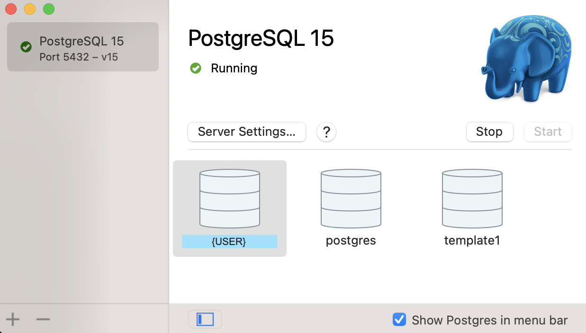
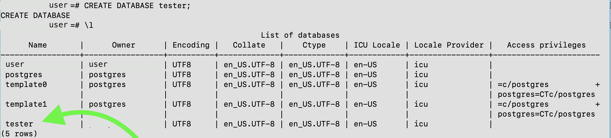
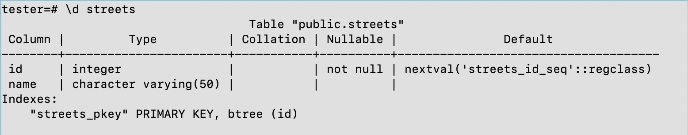

[To install PostgreSQL on Mac](https://www.postgresql.org/download/macosx/), I have found the simplest method to be by downloading the Postgres.app.

Before starting, ensure that all instances of Postgres are uninstalled/deleted from the system because the app cannot start while another server is already running on the same port.

- Homebrew
Homebrew can be employed for this deletion. It is worth noting here that “postgresql” is being deprecated so if your Homebrew download was version specific (e.g postgresql@15), then you would simply add “@“ and the version installed on your system in the statement. 
The Homebrew statement for uninstalling: 
```
$ brew remove postgresql
```

- EnterpriseDB (EDB)
This comes with a Postgres uninstall package usually found at:
Users > {user} > Library > PostgreSQL , opening the file will uninstall PostgreSQL and associated applications such a pgAdmin.
More auxiliary files to delete can be found at: Users > {user} > Library > Application Support. Search for and delete any other existing Postgres files. Be careful not to delete Postgres files linking to other apps where PostgreSQL may be used such as MAMP, Anaconda, Ruby, QGIS, etc. 

### Starting installation:
Visit https://postgresapp.com/ to download the latest .dmg file, initialise a server and paste the code to configure a ```$PATH``` to enable command line tools. Upon following the instructions, Postgres.app should be open and a server should be live (example in image below). Three default databases are created upon launching this app. One is postgres, the other is template1 and the last is your username. 



Since we have also configured your $PATH at this stage, close the terminal and open it again. This time, type: "psql" and the version number should show alongside a "help" option. 


This means the above process was succesful and your command line is connected to your currently live server. We're good to go! 

> Graphical clients such as Postico and pgAdmin 4 are excellent at limiting the coding required to navigate databases but before we get there, let's understand the terminal/command line point of view. 

### Working with the command line

```\?``` opens the help commands; only a fraction are shown below.
```
Help
  \? [commands]          show help on backslash commands
  \? options             show help on psql command-line options
  \? variables           show help on special variables
  \h [NAME]              help on syntax of SQL commands, * for all commands
```
```\? [options]``` yields:
```
Usage:
  psql [OPTION]... [DBNAME [USERNAME]]

General options:
  -c, --command=COMMAND    run only single command (SQL or internal) and exit
  -d, --dbname=DBNAME      database name to connect to (default: "pollyramaselele")
  -f, --file=FILENAME      execute commands from file, then exit
  -l, --list               list available databases, then exit

Connection options:
  -h, --host=HOSTNAME      database server host or socket directory (default: "local socket")
  -p, --port=PORT          database server port (default: "5432")
  -U, --username=USERNAME  database user name (default: "pollyramaselele")
  -w, --no-password        never prompt for password
  -W, --password           force password prompt (should happen automatically)
```

Familiarise yourself with both the SQL and command line commands.


##### Creating a database
1. First, we create a database named tester. Then the command ```"\l"``` lists all databases

```sql
CREATE DATABASE tester
```


2. We then connect our database. We can change the database we're connected to by simply typing ```\c``` + ```database name```.
```
\c tester  
```
```sql
# Success message
You are now connected to database "tester" as user "{user}".
```

To delete the database:
```sql
DROP DATABASE tester
```

3. Now we can create tables. Continue the PSQL documentation from 15.2.7.


##### Creating a table
We use conventional SQL to do this. ```\d ``` describes the table. A ```SELECT * FROM streets``` would simply show the columns. 



 > > By visiting [Mockaroo](https://www.mockaroo.com/), you can create mock datasets to practice on.

Add foreign key references:
```sql
-- After creation
ALTER TABLE people
  ADD CONSTRAINT people_streets_fk FOREIGN KEY(street_id) REFERENCES streets(id); 

-- At time of table creation
create table people (
    id serial not null primary key,
    name varchar(50),
    dob date
    street_id int references streets(id) not null,
    phonenum varchar null);