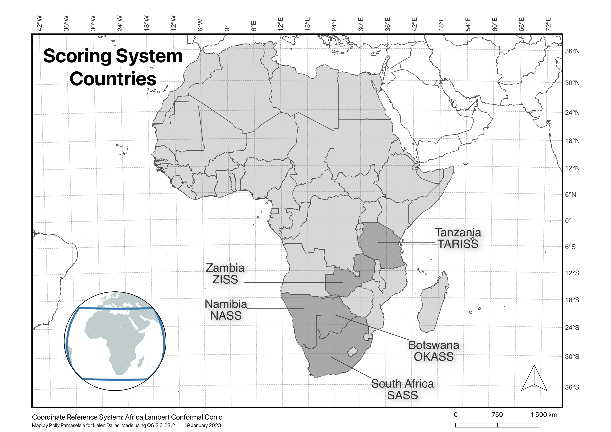
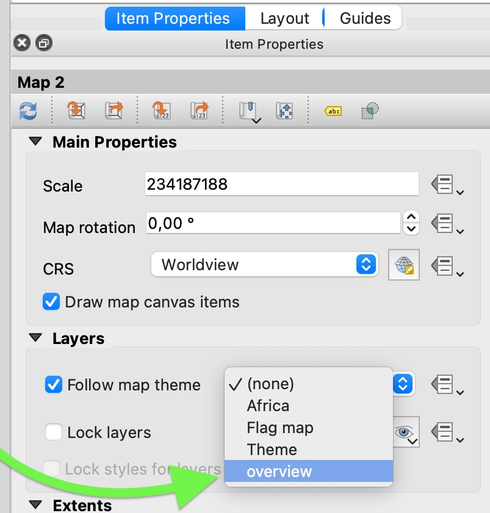

# Lab Notes

## :earth_africa: QGIS - Cartographic skills
#### Tips

- Present insights, not data.
- Be cognisant of your audience.

Image | Tip
-|:-:
 | The geographic coordinate system tells us where the data is located on the earth's surface and the projected coordinate system tells the data how to draw on a flat surface, like on a paper map or a computer screen.
 | When styling labels, do not use both a shadow and buffer. Choose one to keep the map simple.
 | Replace coordinates in Coordinate box with the word 'world' to display the world map.

<h3 style="text-align: center">Simple Africa Map</h3>

 
To succesfully create the above, we first display the World Map by replacing the values in the Coordinate text box with 'world', create a geopackage and drag the world basemap into this geopackage.
We then calculate and create a new attribute data for the Scoring System Countries via the field calculator. This allows us to style just relevant countries. Label the countries using callouts, manually placing them to reduce clutter. Create a new theme and save this style. Create another theme called overview and style the world map monochrome with no brush stroke. Save the style to the new theme, this will be for the inset map.
We're then ready to initiate a map layout. Add graticules and change the CRS' to a projected CRS. Add your basic map elements and inset map ensuring that it is cropped to a circle shape. Change the CRS' of both the main map and inset. Insert a textbox below the map to annotate it with its map CRS. We use the expression builder to do this.


#### Procedures

Adding an inset map:
Step | Image | Description
-|-|:-:
1 |  | Once you have completed your main map, Add a new style and name it _main_. This will save your current layout and allow us to start the inset map style.
2 |  | Style this layer with a simple solid fill and no pen stroke style. Apply.
3 |  | Now click on the Theme Manager eye icon and Add Theme. Name this theme overview and click 'OK' to save it.
4 |  | Open a New Print Layout (cmd+P/alt+P) and 'Add Map' for the main map. Repeat this for the second map. Finally, under Item Properties > Layers, choose _overview_ as the map theme to follow for the second map.

<!-- Making a simple flagmap:
Step | Image | Instruction |
-|-|:-: -->

## :file_folder: GitHub
- Forking a GitHub repository 

Image | Tip
-|:-:
 | On the GitHub site, click on 'Fork'. Leave the details unchanged and click 'Create Fork'.

- Cloning a forked repo using VS Code

Image | Tip
-|:-:
 | Open the Command Palette and type 'Git', select 'Clone', choose 'Clone from GitHub' and select the forked repo.
 | There you have it! Your forked repository cloned.


_
## :globe_with_meridians: OpenStreetMap
[OSM](https://www.openstreetmap.org/)

Upon signing in, choose to Edit with iD to edit in the browser.  
Image | Description
-|:-:
 | The OSM interface allows you to choose to between different terrain and satellite basemaps/backgrounds to help map more accurately. Ensuring that an oscurity in one basemap can be abated when changing to another.
 | Upon digitising your point, line or polygon, Edit Feature allows adding attributes to your data. 
 | Using the same OSM account, you can contribute to the Humanitarian OpenStreetMap Team (HOT) projects to help scholars and developers throughout the world. The more accurate edits, the higher your score and the more reliable you are considered to be.

_
## :computer: Computer Logic
### Working with Binary Numbers
Refined by Gottfried Leibniz, who realised that the binary number system combined principles of arithmetic & logic. Binary is how the computer calculates, communicates data via data signals. It is a number expressed in the base-2 numeral system[^1]. Just 0 and 1. Two unique characters to represent a world of numbers.  
The number of patterns possible is = 2^bits^

<!-- Footnote -->
[^1]: https://computerscience.chemeketa.edu/cs160Reader/Binary/Bytes.html

0 0 0 0 - 4 Binary digit (bit) number
^ ^ ^ ^
8 4 2 1 - Binary base number (these are multiples of two)

For example,
1.  3-bit binary numbers:

<table>
  <tr>
    <th>Binary</th>
    <td>000</td>
    <td>001</td>
    <td>010</td>
    <td>011</td>
    <td>100</td>
    <td>101</td>
    <td>110</td>
    <td>111</td>
  </tr>
  <tr>
    <th>Decimal</th>
    <td>0</td>
    <td>1</td>
    <td>2</td>
    <td>3</td>
    <td>4</td>
    <td>5</td>
    <td>6</td>
    <td>7</td>
  </tr>
</table>

We see that  2^bits^ = the number of unique decimal digits that can be represented.


2. 8-bit binary number:

<table>
  <tr>
    <th>Bit</th>
    <td>1</td>
    <td>0</td>
    <td>0</td>
    <td>1</td>
    <td>0</td>
    <td>1</td>
    <td>0</td>
    <td>1</td>
  </tr>
  <tr>
    <th>Base</th>
    <td>128</td>
    <td>64</td>
    <td>32</td>
    <td>16</td>
    <td>8</td>
    <td>4</td>
    <td>2</td>
    <td>1</td>
</table>

This 8-bit number is 149 in decimal digits [149~10~]. 

>Computer memory is organized into groups of eight bits. Each eight-bit group is called a byte. Because it has 8 bits, it can store 2^8^ or 256 unique values

### Working with Hexadecimals

Hexadecimal is base 16. It uses half a byte or _nibbles_ to represent numbers.

<table>
  <tr>
    <th>Hexadecimal</th>
    <td>0</td>
    <td>1</td>
    <td>2</td>
    <td>3</td>
    <td>4</td>
    <td>5</td>
    <td>6</td>
    <td>7</td>
    <td>8</td>
    <td>9</td>
    <td>A</td>
    <td>B</td>
    <td>C</td>
    <td>D</td>
    <td>E</td>
    <td>F</td>
  </tr>
  <tr>
    <th>Decimal</th>
    <td>0</td>
    <td>1</td>
    <td>2</td>
    <td>3</td>
    <td>4</td>
    <td>5</td>
    <td>6</td>
    <td>7</td>
    <td>8</td>
    <td>9</td>
    <td>10</td>
    <td>11</td>
    <td>12</td>
    <td>13</td>
    <td>14</td>
    <td>15</td>
</table>

A hexadecimal number:
<table>
  <tr>
    <th>Hexadecimal</th>
    <td>1</td>
    <td>E</td>
    <td>A</td>
  </tr>
  <tr>
    <th>Base</th>
    <td>256</td>
    <td>16</td>
    <td>1</td>
</table>

So the hexadecimal number 1EA is (256 x 1) + (16 x 14) + (1 x 10) = 490~10~


### Some terms
CPU - Controls all activities and can be considered the home of switches on the motherboard.

GPU - improves significantly on the graphics output of the system and can do CPU functions under peak performance.

RAM is the retrievable and changeable memory of the computer while ROM is data that cannot be modified after the manufacture of the storage device. It primarily stores software that barely changes.

A Solid-state drive (SSD) stores data on interconnected flash-memory chips and retrieves digital info using only electronic circuits without any involvement of moving mechanical parts while the traditional hard drive is the basic non-volatile storage that doesn't "go away" when you turn off the system with a read/write head on an arm (or a set of them) accesses the data while the platters are spinning.[^2]

[^2]: https://www.pcmag.com/news/ssd-vs-hdd-whats-the-difference


_

## :pencil: Scratch
[Scratch](https://scratch.mit.edu/) is a coding interface for children and a coding language with a simple visual interface that allows young people to create digital stories, games, and animations. It simplifies the coding process with drag-and-drop functionality for all kinds of inputs. It is perfect for intoducing beginners to the world of coding.


**My Ping Game** (code below):
<iframe src="https://scratch.mit.edu/projects/796534306/embed" allowtransparency="true" width="485" height="402" frameborder="0" scrolling="no" allowfullscreen></iframe>

 


<!-- EXAMPLE CODE -->
<!-- Example code block -->
<!-- ```json
{
  "firstName": "John",
  "lastName": "Smith",
  "age": 25
}
``` -->